# Wsl installation

_From 2023 VG151 teaching team, wr_

_Modified by zzjc, lsr_

## Windows (using wsl)

### What/why
In simple terms: WSL is a feature in Windows that lets you run a virtual machine for Linux directly on your Windows, as if you were on an Ubuntu, Debian, or other Linux computer. The greatest advantage is that it allows to run Linux and Windows **simultaneously**.

**Why linux a better OS for development:** For developers, its powerful commandline interface, package managers (like apt), customizable environment are primary draws. It streamlines software installation, scripting, and automation. What's more, **JOJ** used in ENGR1010J/1510J is run within linux environment. So if you use Windows, you may encounter *"It works on my computer! Why can't it work in JOJ?"*

**Notice:** wsl is only an environment, you have to install **one linux distro** (like ubuntu/debian/arch) along the way.

### Requirements(wsl2)

- If your computer uses windows 10:  
   - For x64 systems: Version 1903 or later, with Build 18362.1049 or later.  
   - For ARM64 systems: Version 2004 or later, with Build 19041 or later.  
- All versions of Windows 11 support wsl2.
- For Mac and Linux users, you don't need to install wsl.  

**Update your windows if it doesn't match the requirements, or move on to wsl1 section to install wsl1 instead.**

**Notice:** VMware is not compatible with Hper-V in older versions. If you are already using VMare, check whether it meets the minimum requirements: Windows 10 20H1 build 19041.264 or later; VMware Workstation/Player 15.5.5 or later.  
If not, please update / uninstall VMware and Windows / don't use wsl.  

### Best scenario
run
```powershell
wsl.exe --install
```
If no error along the well and it's fast, then congratulations! You have wsl installed with ubuntu!  
To install another distro, run
```powershell
wsl.exe --list --online
```
And choose the distro listed and replace \<distro> with it
```powershell
wsl.exe --install <Distro>
```
Then run to set the default distro for wsl
```powershell
wsl.exe --set-default <Distro>
```

Now run to enter wsl
```
wsl
```
- If you are required to set user and password and no errors, then you are good to close this documentation!  
- If you have no errors except that you are not required to set user and password, and when you run `wsl` you are faced with `root@xxx`, then go to `Reminder` section's Case 1.
- If you have already faced issues during `wsl --install`, then please follow `Steps` section to follow commands step by step.  
### Steps

**There's an official tutorial:** https://learn.microsoft.com/en-us/windows/wsl/install-manual. But you can follow our guidance as well.  

1. To enable Linux feature  
run `Powershell` with **administrator**  


Copy and paste the following command in Powershell and hit Enter:  

```powershell
dism.exe /online /enable-feature /featurename:Microsoft-Windows-Subsystem-Linux /all /norestart
```
```powershell
dism.exe /online /enable-feature /featurename:VirtualMachinePlatform /all /norestart
```
**Make sure you type exactly the same.**    

If you see this, then you are good to go.  


2. Now **restart** your computer.  

3. Check again whether your PC support WSL2:

   - In powershell run `systeminfo`
   - Scroll down to Hyper-V section
   - If there are 4 "Yes" OR " A hypervisor has been detected. Features required for Hyper-V will not be displayed." ("已检测到虚拟机监控程序。将不显示 Hyper-V 所需的功能。"), then your PC is OK
   - Otherwise it's not OK, please use WSL1 or other vm platform

3. Setup wsl2
```powershell
wsl.exe --install
```
```powershell
wsl --set-default-version 2
```

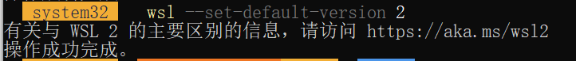

### wsl1 installation

**Notice: This is the fallback plan for failing to install wsl2. It's very recommended to try to install wsl2.**

run `Powershell` with **administrator**  


Copy and paste the following command in Powershell and hit Enter:  
```powershell
dism.exe /online /enable-feature /featurename:Microsoft-Windows-Subsystem-Linux /all /norestart
```

Now you can move on to install a linux distro: ubuntu **or** debian **or** arch.  

### Debug

#### Case 1: No error

- Go on and install linux distro in your wsl2.  

#### Case 2: Error with link https://aka.ms/wsl2kernel attatched

- Go to https://aka.ms/wsl2kernel and download a patch
- start wsl2 again
- If network is slow, consider use winget to install wsl and turn on your proxy

##### Case 2.1 Case 5: Error: 0x800701bc
Go to following link for tutorial:  
https://learn.microsoft.com/zh-cn/windows/wsl/install-manual#step-4---download-the-linux-kernel-update-package  
The installaztion link:  
https://wslstorestorage.blob.core.windows.net/wslblob/wsl_update_x64.msi

#### Case 3: Error telling you Hyper-V is not enabled

- Go to Control Panel (控制面板) > Programs (程序) > Turn Windows features on or off (启用或关闭Windows功能)
- Find Hyper-V

##### Case 3.1: No Hyper-V Settings

- You should check whether your PC support WSL2. See above.

##### Case 3.2: All 4 settings in Hyper-V can be ticked

- Tick all settings
- Restart your PC
- Try to start wsl2 again

##### Case 3.3: Some of the settings can't be ticked

This might be an issue with your hardware. Please refer to section "How to Enable Hardware Virtualization in BIOS" in https://www.makeuseof.com/windows-11-enable-hyper-v/ and try to enable hardware virtualization. (My laptop thinkpad has this issue)

#### Case 4: Catastrophic failure(灾难性故障)
This error may due to corruptions during wsl installation. A reinstall may work.  
You can try the following commands:  

1. 
```powershell
wsl --update
```

2. 
```powershell
Disable-WindowsOptionalFeature -Online -FeatureName "Microsoft-Windows-Subsystem-Linux" -NoRestart
```
```powershell
Disable-WindowsOptionalFeature -Online -FeatureName "VirtualMachinePlatform" -NoRestart
```
**Restart your computer.**  
Then run these two commands again:
```powershell
dism.exe /online /enable-feature /featurename:Microsoft-Windows-Subsystem-Linux /all /norestart
```
```powershell
dism.exe /online /enable-feature /featurename:VirtualMachinePlatform /all /norestart
```
3. go to https://pan.sjtu.edu.cn/web/share/bc19722cabba0d5bf35826eb9e1e1b8a and download wsl.2.6.1.0.x64.msi if your computer is x64, or wsl.2.6.1.0.arm64.msi if it's ARM.  

4. 
```powershell
Get-AppxPackage MicrosoftCorporationII.WindowsSubsystemforLinux -AllUsers | Remove-AppxPackage
```
```powershell
wsl --update --web-download
```

#### Case 5: 0x80370114Error
run  
```
Disable-WindowsOptionalFeature -Online -FeatureName "HypervisorPlatform" -NoRestart
```
or  
Go to `Open or close Windows features`(启用或关闭Windows功能) and cancel Windows Hypervisor Platform(windows虚拟机监控程序平台).  
**Then restart your computer.**

#### Case 6: 0x8007019eError
You could try the following command:  
1. 
```
wsl --set-default-version 2
```
2. 
```
wsl --update
```

3. try the solution of Case 2.1.  
#### Case 7: ubuntu files not found
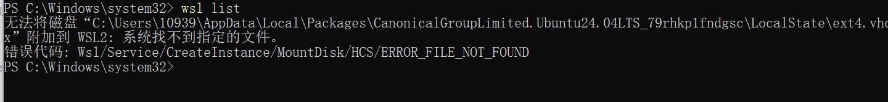
This may due to changes of the path of ubuntu files. Try:  
```
wsl --unregister Ubuntu
```
And reinstall ubuntu.  

#### Case 8: wsl command not found
Install wsl with winget:
```
winget install Microsoft.WSL
```

#### Otherwise

- Search online with error message on your screen (better go to stackoverflow/microsoft doc/github issues)
- Just use WSL1. It has no big issue.

### Download Linux Distro

Install Linux (Ubuntu/Debian/arch, you **only** need choose **one**)


#### Jbox

I download latest ubuntu, debian and arch packages from ms official website, you can download **one of them**. If you use ubuntu and debian, just click the file and everything will be done automatically. If you use arch, you need to run `wsl --install --from-file <file-path>`. By arch wiki simply run ` wsl --install archlinux` is fine, but it is not tested by us.  
链接: https://pan.sjtu.edu.cn/web/share/998f65b3a2da2ba1b0a3251c57e8b815, 提取码: 8kk6  
sample code(**Arch**)
```powershell
wsl --import Arch "$env:LOCALAPPDATA\wsl\Arch" ".\Downloads\archlinux.wsl" --version 2
```
#### Microsoft Store(slow and instable)
You could also download them in Microsoft Store(**no need if you successfully install them from Jbox**) but it is not recommended as it may be slow.  
Take installing Ubuntu as an example:  
Go to Microsoft Store and search "Ubuntu"


Download one of them. Recommend:24.04.    
*Hint: if it's slow, please download it from Jbox.*


#### Ubuntu
Ubuntu is a linux distro which is widely used and simple for beginners.  

Then click on `open` in microsoft store or double click the file downloaded from jbox.  

Setup your user name and password. **The password will not be shown in the terminal when you type in.**
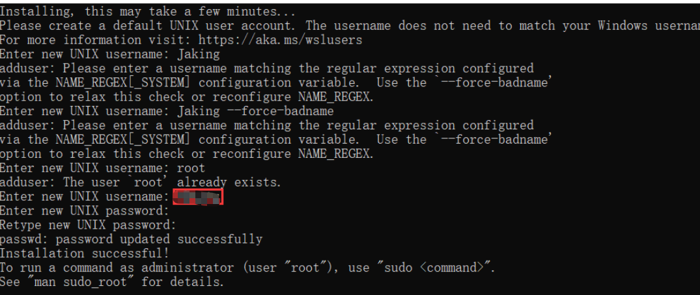

run the following commands to install essen tial packages. 
```bash
$ sudo apt update
$ sudo apt install build-essential
$ gcc --version
```
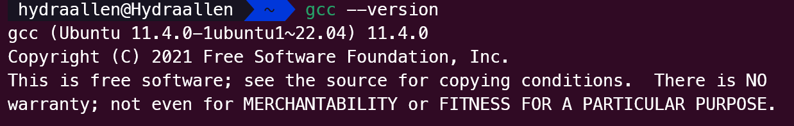


#### Debian
the steps are exactly the same as ubuntu.

#### Arch

You may refer to the official website.

Here, we demonstrate the first method.

1. [Download](https://github.com/yuk7/ArchWSL/releases/latest) the installer zip.

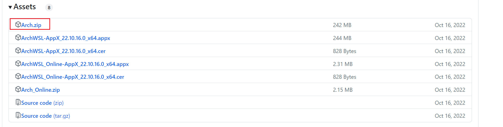
*Hint: if it's slow, please go to`JBox` section and download Arch there.*

2. Extract all files in zip file to the same directory. Please extract to a folder that you have write permission. For example, `C:\Program Files` cannot be used since the rootfs cannot be modified there.


3. Run `Arch.exe` to extract the rootfs and register to WSL

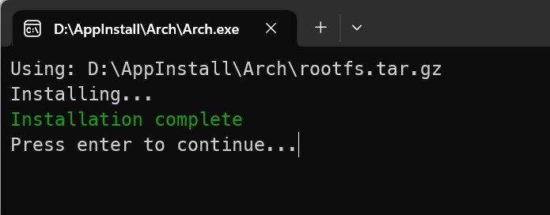

As a side note, the executable name is what is used as the WSL instance name. If you rename it, you can have multiple installs.

4. Open your terminal and choose `arch`.

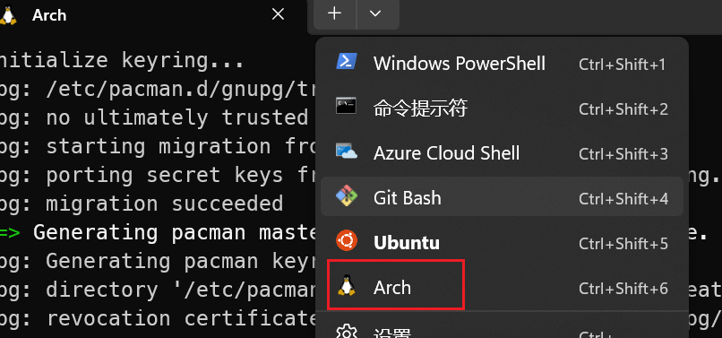

5. Setting the root password

```bash
passwd
```

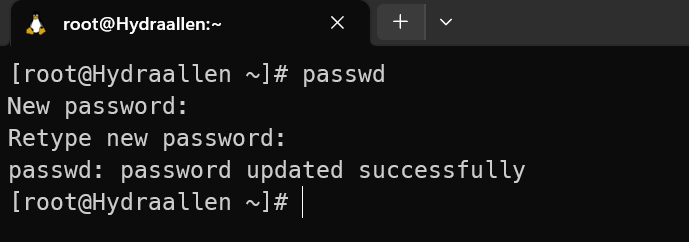

6. Set up the default user

```bash
$ echo "%wheel ALL=(ALL) ALL" > /etc/sudoers.d/wheel
$ useradd -m -G wheel -s /bin/bash {username}
$ passwd {username}
```

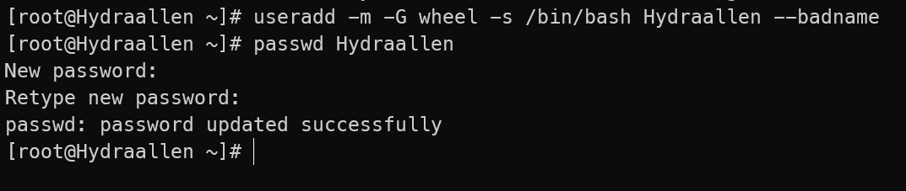

```bash
$ exit
$ Arch.exe config --default-user {username}
```

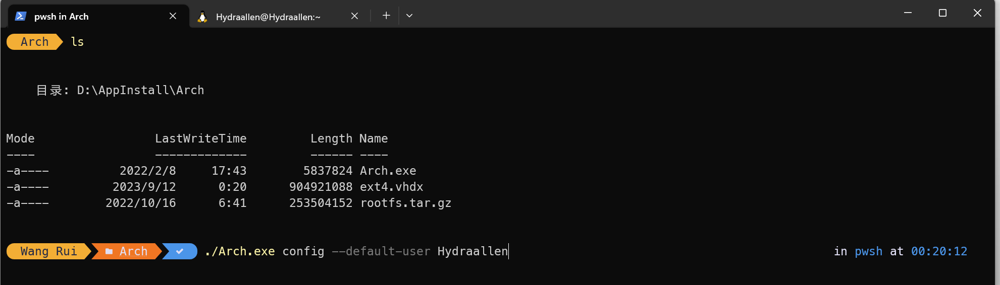

If the default user has not been changed ([issue #7](https://github.com/yuk7/ArchWSL/issues/7)), please reboot the computer or alternatively, restart the LxssManager in an Admin command prompt. _Please refer to the official documentation._

7.  initialize the keyring

```bash
$ sudo pacman-key --init
$ sudo pacman-key --populate
$ sudo pacman -Sy archlinux-keyring
$ sudo pacman -Su
```

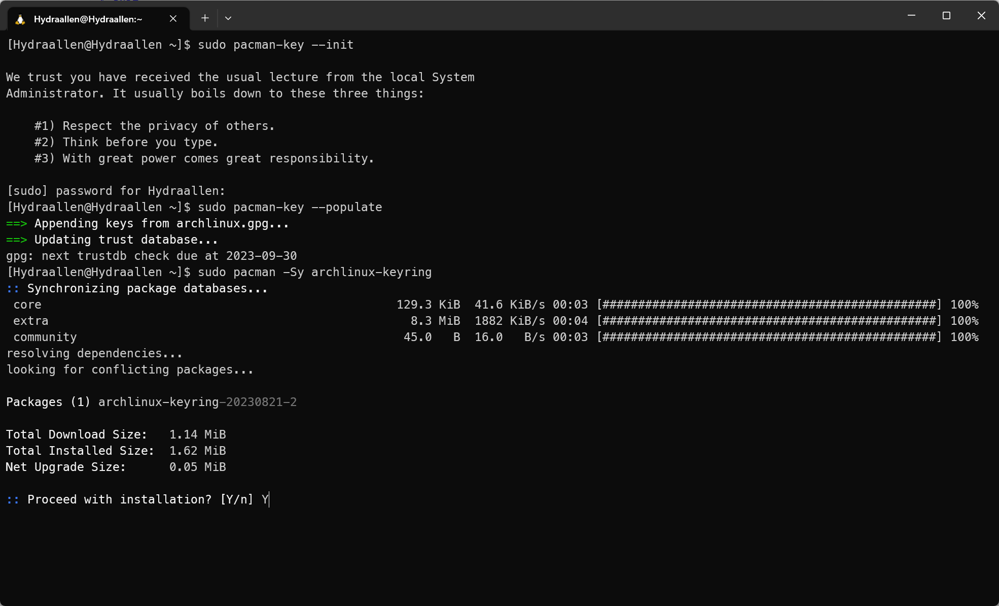

8. Install gcc

```bash
$ sudo pacman -S gcc
```

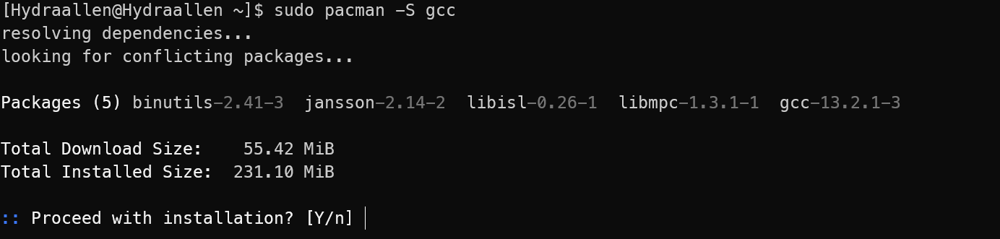

9. test gcc

```bash
$ gcc --version
```


### Reminder:
If you face issues when installing arch, please search online or just switch to ubuntu/debian.  

### Reminder  

#### Case 1: No username and password required

In this case, you may see something like `root@xxx` in the terminal, which means you are logging in as a root user(superuser). You need to set up a normal user with following commands:  
```bash
$ adduser <username>
$ su - <username>
```
seeing `<username>@xxx:~$` means it's successful.  

### Usage

Open `Powershell` or `cmd`, type:  
```powershell
wsl
```
Then you will enter the linux environment in the terminal(wsl will choose the default linux distro). Now go on and code!  