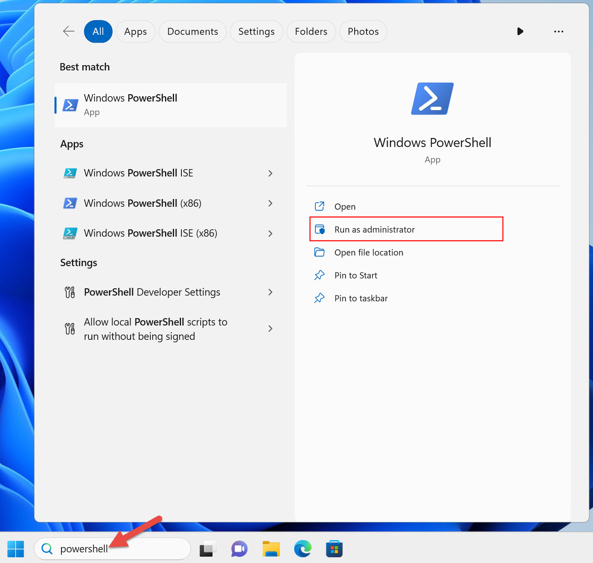

# Wsl installation

_From 2023 VG151 teaching team, wr_

_Modified by zzjc_

## Windows (using wsl)

### What/why

### Requirements

- Windows 10 1709 Fall Creators Update 64bit or later.
- Windows Subsystem for Linux feature is enabled.  
- For Mac and Linux users, you don't need to install wsl.  

### Steps
1. To enable Linux feature


Then run `Powershell` with **administrator**  



Copy and paste the following command in Powershell and hit Enter:  

```bash
dism.exe /online /enable-feature /featurename:Microsoft-Windows-Subsystem-Linux /all /norestart
```
**Make sure you type exactly the same.**   

If you see this, then you are good to go.  


### Reminder
1. VMware is not compatible with Hper-V in older versions. If you are already using VMare, check whether it meets the minimum requirements: Windows 10 20H1 build 19041.264 or later; VMware Workstation/Player 15.5.5 or later.  
If not, please update/uninstall VMware/don't use wsl.  

2. Check whether your PC support WSL2:

   - In cmd run `systeminfo`
   - Scroll down to Hyper-V section
   - If there are 4 "Yes" OR " A hypervisor has been detected. Features required for Hyper-V will not be displayed." ("已检测到虚拟机监控程序。将不显示 Hyper-V 所需的功能。"), then your PC is OK
   - Otherwise it's not OK, please use WSL1 or other vm platform

3. Setup wsl2

```bash
wsl --set-default-version 2
```


#### Case 1: No error

- Go on and install linux distro in your wsl2.  

#### Case 2: Error with link https://aka.ms/wsl2kernel attatched

- Go to https://aka.ms/wsl2kernel and download a patch
- start wsl2 again
- If network is slow, consider use winget to install wsl and turn on your proxy

##### Case 2.1 Case 5: Error: 0x800701bc
Go to following link for tutorial:  
https://learn.microsoft.com/zh-cn/windows/wsl/install-manual#step-4---download-the-linux-kernel-update-package  
The installaztion link:  
https://wslstorestorage.blob.core.windows.net/wslblob/wsl_update_x64.msi

#### Case 3: Error telling you Hyper-V is not enabled

- Go to Control Panel (控制面板) > Programs (程序) > Turn Windows features on or off (启用或关闭Windows功能)
- Find Hyper-V

##### Case 3.1: No Hyper-V Settings

- You should check whether your PC support WSL2. See above.

##### Case 3.2: All 4 settings in Hyper-V can be ticked

- Tick all settings
- Restart your PC
- Try to start wsl2 again

##### Case 3.3: Some of the settings can't be ticked

This might be an issue with your hardware. Please refer to section "How to Enable Hardware Virtualization in BIOS" in https://www.makeuseof.com/windows-11-enable-hyper-v/ and try to enable hardware virtualization. (My laptop thinkpad has this issue)

#### Case 4: Catastrophic failure(灾难性故障)
This error may due to corruptions during wsl installation. A reinstall may work.  
You can try the following commands:  
1. Go to `Open or close Windows features`(启用或关闭Windows功能) and cancel the above two features, reboot, tick the above two features and reboot

2. 
```bash
$ wsl --shutdown
$ wsl --update
$ wsl --install
```
3. go to https://github.com/microsoft/WSL/releases and download wsl.2.6.1.0.x64.msi if your computer is x64, or wsl.2.6.1.0.arm64.msi if it's ARM.  

4. 
```bash
$ Get-AppxPackage MicrosoftCorporationII.WindowsSubsystemforLinux -AllUsers | Remove-AppxPackage
$ wsl --update --web-download
```

#### Case 5: 0x80370114Error

Go to `Open or close Windows features`(启用或关闭Windows功能) and cancel Windows Hypervisor Platform(windows虚拟机监控程序平台).


#### Case 6: 0x8007019eError
You could try the following command:  
1. 
```
wsl --set-default-version 2
```
2. 
```
wsl --update
```

3. try the solution of Case 2.1.  
#### Case 7: ubuntu files not found

This may due to changes of the path of ubuntu files. Try:  
```
wsl --unregister Ubuntu
```
And reinstall ubuntu.  

#### Case 8: wsl command not found
Install wsl with winget:
```
winget install Microsoft.WSL
```

#### Otherwise

- Search online with error message on your screen (better go to stackoverflow/microsoft doc/github issues)
- Just use WSL1. It has no big issue.

4. Install Linux (Ubuntu/Debian/arch, you only need choose **one**)


### Ubuntu
Ubuntu is a linux distro which is widely used and simple for beginners.  

Go to Microsoft Store and search "Ubuntu"


Download one of them. Recommend:24.04.    
*Hint: if it's slow, please scroll down to "JBox" section and download ubuntu there.*

Open your terminal and choose `ubuntu`.

Setup your user name and password. **The password will not be shown in the terminal when you type in.**


run the following commands to install essen tial packages. 
```bash
$ sudo apt update
$ sudo apt install build-essential
$ gcc --version
```


### Debian
the steps are exactly the same as ubuntu.

### Reminder  

#### Case 1: No username and password required

In this case, you may see something like `root@xxx` in the terminal, which means you are logging in as a root user(superuser). You need to set up a normal user with following commands:  
```bash
$ adduser <username>
$ su - <username>
```
seeing `<username>@xxx:~$` means it's successful.  

#### Case 2:

### Arch

You may refer to the official website.

Here, we demonstrate the first method.

1. [Download](https://github.com/yuk7/ArchWSL/releases/latest) the installer zip.


*Hint: if it's slow, please scroll down to "JBox" section and download Arch there.*

2. Extract all files in zip file to the same directory. Please extract to a folder that you have write permission. For example, `C:\Program Files` cannot be used since the rootfs cannot be modified there.


3. Run `Arch.exe` to extract the rootfs and register to WSL


As a side note, the executable name is what is used as the WSL instance name. If you rename it, you can have multiple installs.

4. Open your terminal and choose `arch`.


5. Setting the root password

```bash
passwd
```


6. Set up the default user

```bash
$ echo "%wheel ALL=(ALL) ALL" > /etc/sudoers.d/wheel
$ useradd -m -G wheel -s /bin/bash {username}
$ passwd {username}
```


```bash
$ exit
$ Arch.exe config --default-user {username}
```


If the default user has not been changed ([issue #7](https://github.com/yuk7/ArchWSL/issues/7)), please reboot the computer or alternatively, restart the LxssManager in an Admin command prompt. _Please refer to the official documentation._

7.  initialize the keyring

```bash
$ sudo pacman-key --init
$ sudo pacman-key --populate
$ sudo pacman -Sy archlinux-keyring
$ sudo pacman -Su
```


8. Install gcc

```bash
$ sudo pacman -S gcc
```


9. test gcc

```bash
$ gcc --version
```


### Reminder:
If you face issues when installing arch, please search online or just switch to ubuntu/debian.  


### Jbox

I download latest ubuntu, debian and arch packages from ms official website, you can download **one of them**. If you use ubuntu and debian, just click the file and everything will be done automatically. If you use arch, you need to run `wsl --install --from-file <file-path>`. By arch wiki simply run ` wsl --install archlinux` is fine, but it is not tested by us.

分享内容: archlinux.wsl 等3个

链接: https://pan.sjtu.edu.cn/web/share/998f65b3a2da2ba1b0a3251c57e8b815, 提取码: 8kk6

sample code(**Arch**)

```bash
wsl --import Arch "$env:LOCALAPPDATA\wsl\Arch" ".\Downloads\archlinux.wsl" --version 2
```


### Usage

Open `Powershell` or `cmd`, type:  
```
wsl
```
Then you will enter the linux environment in the terminal(wsl will choose the default linux distro). Now go on and code!  